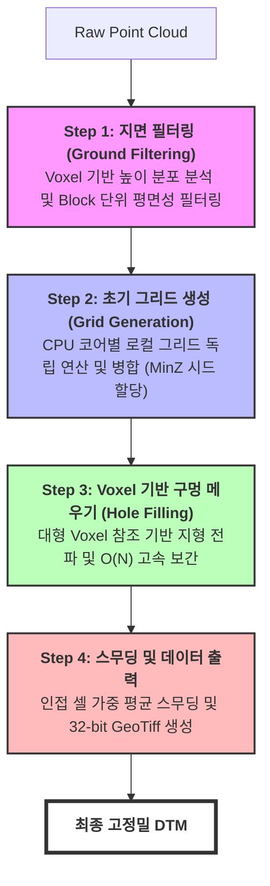

## 프로젝트 개요 (Overview)
- **프로젝트명**: 대규모 도시급 항공 GIS 상용 툴 개발 (Indonesia Project)
- **기간**: 2025.07 ~ Present
- **역할**: Team Member (C# 파이프라인 설계 및 최적화, 딥러닝 모듈 통합)
- **기술 (Tech Stack)**: C#, Python, PDAL, GDAL, SAM, EfficientNet, Nuitka

##  주요 성과 (Key Achievements)
- 데이터 처리 시간 36시간 → 약 1시간으로 단축 (69GB 원본 데이터 기준 약 36배 성능 개선)
- 69GB 규모의 원본 데이터를 321MB 수준으로 전처리 및 처리 효율화 (압축률 약 200배)
- 사우디/두바이 이외의 신규 해외 사업(인도네시아) 확장 및 기술 솔루션 현지화 성공

##  상세 업무 및 기여 (Responsibilities & Contributions)

### 1. 하이브리드 아키텍처 기반의 통합 GIS 프로그램 설계
- **문제 상황/목표**: 딥러닝 연구팀에서 개별적으로 작성된 Python 스크립트들을 현지 사용자가 쉽게 조작할 수 있는 단일 프로그램으로 묶어야 함.
- **해결 방안 (Action)**: Python 환경을 C# 응용 프로그램 내부에서 제어하고 통신할 수 있는 하이브리드 아키텍처를 설계하여 파이프라인 일원화.
- **결과 (Result)**: 13종 이상의 Python/PyTorch 워크로드를 Nuitka(바이너리 컴파일)와 UV 환경을 통해 안전하고 독립적으로 실행되는 단일 소프트웨어 패키지로 배포 성공.

### 2. 항공 데이터 기반 SHP 자동 병합 로직 개발
- **문제 상황/목표**: 다중 TIF 이미지에서 건물을 추출하고 병합할 때, 항공 이미지 간 겹치는 영역이 발생하여 SHP 파일에 중복 데이터가 쌓임.
- **해결 방안 (Action)**: TIF → PNG 변환 후, Airborne 데이터와 Global Building, OSM 데이터를 결합하는 단계에서 공간 좌표 기반의 중복 영역 자동 감지 및 병합 알고리즘 구현.
- **결과 (Result)**: 중복 면적이 완벽히 제거된 깔끔한 SHP 결과물 생성 파이프라인 확립.

*GIS 툴에서 중복 영역이 빨간색으로 표시된 모습*

### 3. 고속 DTM(지형 모델) 생성 파이프라인 자체 구현
- **문제 상황/목표**: 기존 오픈소스(PDAL CSF) 방식은 69GB 지면 필터링 및 DTM 생성에 약 36시간이 소요되어 상용 서비스 가용성이 매우 떨어짐. 외부에서 완성된 DTM을 제공받기 어려운 현지 상황 대응 필요.
- **해결 방안 (Action)**: 정밀도와 속도 간의 **Trade-off**를 고려하여, 렌더링에 최적화된 고속 C# 네이티브 지면 필터링 및 보간 알고리즘 구현. Voxel 기반 높이 분석과 멀티스레드 병렬 처리를 통해 프로그램 내부에서 즉시 DTM 생성이 가능하도록 설계.
- **결과 (Result)**: 69GB 데이터 처리 시간을 1시간 이내로 단축하여 실 사용자들이 별도의 DTM 데이터 없이도 작업을 즉각 시작할 수 있는 환경 구축. 해당 DTM은 후속 공정인 '.obj 메쉬 모델 자동 생성'의 핵심 베이스 데이터로 활용 중.

*Voxel 기반 높이 분석 및 Block 단위 평면 필터링 과정*

| PDAL CSF 방식 | C# 커스텀 알고리즘 |
|:---:|:---:|
|  |  |

*DTM 생성 전 최종 바닥면 추출 결과*

---

## 🔗 관련 기술 블로그
- **[Nuitka를 이용한 Python 프로젝트 보안 배포](https://jinwoo-sync.github.io/2026/03/01/nuitka-python-deployment.html)**: 상용 소프트웨어 배포를 위한 소스코드 보안 및 실행 환경 최적화 과정 정리

---

### 부록: 시스템 구동 시연

  <video width="100%" height="auto" autoplay loop muted playsinline style="border-radius: 8px; box-shadow: 0 4px 12px rgba(0,0,0,0.15);">
    <source src="/assets/videos/projects/indonesia_gis/gis_tool_demo.webm" type="video/webm">
    Your browser does not support the video tag.
  </video>
  
<i>도시급 항공 데이터 처리 상용 GIS 툴 구동 시연</i>

