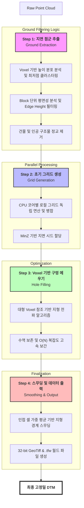

## 프로젝트 개요
인도네시아 도시 단위의 대규모 항공 측량 데이터(항공 카메라, 항공 LiDAR)를 처리하여, 현지 사용자가 직접 운용할 수 있는 **상용 GIS 프로그램**을 개발하는 프로젝트다. 단순히 기술적 구현을 넘어 대규모 데이터의 자동화 처리와 고정밀 지형 모델 생성을 목표로 한다.

  <video width="100%" height="auto" autoplay loop muted playsinline style="border-radius: 8px; box-shadow: 0 4px 12px rgba(0,0,0,0.15);">
    <source src="/assets/videos/projects/indonesia_gis/gis_tool_demo.webm" type="video/webm">
    Your browser does not support the video tag.
  </video>
  
<i>도시급 항공 데이터 처리 상용 GIS 툴 구동 시연</i>

## 나의 역할

- 딥러닝 연구팀이 분할 개발한 Python 스크립트들을 **C# 기반 통합 GIS 프로그램**으로 설계 및 구현
- 데이터 처리 시퀀스 정의, 알고리즘 최적화, 배포 시스템 구축까지 **파이프라인 전체를 주도**
- C# 프로그램 내에서 Python 스크립트를 실행하는 하이브리드 아키텍처 설계 및 구현

---

## 데이터 처리 파이프라인

### 1. SHP 파일 생성
TIF → PNG 변환 → Airborne + Global Building + OSM 데이터 결합 → `.shp` 생성

SHP 생성 과정에서 겹치는 영역을 자동 감지하고 정리하는 기능을 구현했다.

*GIS 툴에서 중복 영역이 빨간색으로 표시된 모습*

### 2. LAS 핸들링 및 DTM 최적화
단순한 높이값 기반의 DSM(Digital Surface Model)을 넘어, 복잡한 지형지물을 제거하고 **순수 지면 높이를 나타내는 고정밀 DTM(Digital Terrain Model)**을 생성한다. 이는 추후 **지붕과 바닥 높이 차를 이용한 .obj 자동 모델링 생성**의 핵심 토대가 된다.

---

## DTM(Digital Terrain Model) 생성 파이프라인

기존 PDAL CSF 방식의 긴 처리 시간을 단축하기 위해, **속도 최적화를 목표로 정밀도를 일정 수준 타협한 프로그램 내장형 임시 DTM 맵 생성 알고리즘**을 구축했다. 고부하 연산을 효율적으로 처리하기 위해 Voxel/Block 통계 분석과 CPU 병렬 처리를 결합하여 실제 서비스 가용성을 높였다.

*DTM 생성 전체 파이프라인 — Raw Points에서 최종 DTM.tif까지*

### DTM 알고리즘 시각화 및 결과 비교

*Voxel 기반 높이 분석 및 Block 단위 평면 필터링 과정*

| PDAL CSF 방식 | C# 커스텀 알고리즘 |
|:---:|:---:|
|  |  |

> **알고리즘 개발 현황**: C# 커스텀 방식의 경우 속도는 비약적으로 향상되었으나, 현재 특정 지형에서 **데이터 공백(Hole)이 간혹 발생하는 이슈**가 확인되었다. 현재 이를 완벽하게 메우기 위한 보간 로직 고도화 작업을 진행 중이다.

*DTM 생성 전 최종 바닥면 추출 결과*

---

## 성능 최적화 결과

| 항목 | 기존 (PDAL CSF) | 개선 후 (C# 파이프라인) |
|------|-----------------|----------------------|
| 데이터 크기 | 69 GB | 321 MB (전처리 후) |
| 처리 시간 | 2,160분 (36시간) | 1분 |
| 처리 속도 | 32.71 MB/min | 307.00 MB/min |
| **성능 비율** | 기준 | **약 10배 개선** |

---

## 관련 기술 블로그
- **[Nuitka를 이용한 Python 프로젝트 보안 배포](https://jinwoo-sync.github.io/2026/03/01/nuitka-python-deployment.html)**: 상용 소프트웨어 배포를 위한 소스코드 보안 및 실행 환경 최적화 과정 정리

---

## 결과물

- 인도네시아 현지에 배포되어 실제 운용 중인 상용 GIS 프로그램
- 69GB 규모의 도시급 항공 데이터를 자동으로 처리하는 엔드투엔드 파이프라인

## 기술적 특징 요약
- **DTM Generation**: Voxel/Block 통계 분석 기반 고정밀 지면 추출 알고리즘 (DSM → DTM 변환)
- **Automation**: 지붕-지면 높이차 분석을 통한 .obj 메쉬 자동 생성 자동화의 핵심 토대 마련
- **Performance**: 병렬 그리드 처리 및 $O(N)$ 복잡도 보간 알고리즘을 통한 10배 이상의 속도 향상
