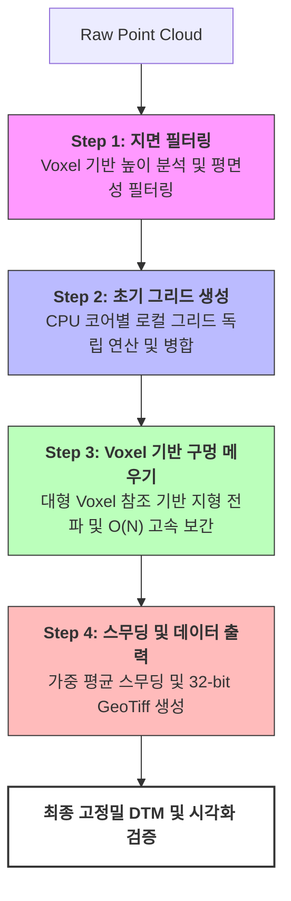

## 프로젝트 개요 (Overview)
- **프로젝트명**: 대규모 도시급 항공 GIS 상용 툴 개발 (Indonesia Project)
- **기간**: 2025.07 ~ Present
- **역할**: Team Member (C# 파이프라인 설계 및 최적화, 딥러닝 모듈 통합)
- **기술 (Tech Stack)**: C#(.NET), Python, PyTorch, C++ Interop(Marshalling), WPF, PDAL, GDAL, SAM3, PyInstaller, Cython

##  주요 성과 (Key Achievements)
- 데이터 처리 시간 36시간 → 약 17시간으로 단축 (70MB/min 처리 속도 기준 약 2.1배 성능 개선)
- 연구팀의 Python 기반 고복잡도 로직을 상용 배포용 C# 네이티브 코드로 독자 재구현하여 서비스 가용성 및 배포 안정성 확보
- 양 팀(연구/개발) 간의 성능 및 속도 Trade-off 정밀 검증과 기술적 간극 해소를 통해 최적화된 엔진을 상용 파이프라인에 최종 반영
- **COPC 마샬링 및 실시간 가시화** 구현으로 대용량 점군 데이터 기반 모델링(LOD2) 정밀 검증 환경 구축

##  상세 업무 및 기여 (Responsibilities & Contributions)

### 1. 하이브리드 아키텍처 기반의 통합 GIS 프로그램 설계
- **문제 상황/목표**: 딥러닝 연구팀에서 개별적으로 작성된 Python 스크립트들을 현지 사용자가 쉽게 조작할 수 있는 단일 프로그램으로 묶어야 함.
- **해결 방안 (Action)**: Python 환경을 C# 응용 프로그램 내부에서 제어하고 통신할 수 있는 하이브리드 아키텍처를 설계하여 파이프라인 일원화.
- **결과 (Result)**: 13종 이상의 Python/PyTorch 워크로드를 PyInstaller·Cython 기반 .exe 및 UV 가상환경을 통해 C# 상용툴 내에서 안전하고 독립적으로 실행되는 단일 소프트웨어 패키지로 배포 성공.

### 2. 항공 데이터 기반 SHP 자동 병합 로직 개발
- **문제 상황/목표**: 다중 TIF 이미지에서 건물을 추출하고 병합할 때, 항공 이미지 간 겹치는 영역이 발생하여 SHP 파일에 중복 데이터가 쌓임.
- **해결 방안 (Action)**: TIF → PNG 변환 후, Airborne 데이터와 Global Building, OSM 데이터를 결합하는 단계에서 공간 좌표 기반의 중복 영역 자동 감지 및 병합 알고리즘 구현.
- **결과 (Result)**: 중복 면적이 완벽히 제거된 깔끔한 SHP 결과물 생성 파이프라인 확립.

  
  
<i>GIS 툴에서 중복 영역이 빨간색으로 표시된 모습</i>

### 3. 고속 DTM 생성 엔진 및 COPC 기반 실시간 점군 가시화·검증 통합
- **문제 상황/목표**: 기존 연구팀 Python 기반 로직(PDAL CSF)의 성능 한계(36시간 소요)와 연구 환경 편중 코드 구조로 인한 상용 배포 어려움. 자동 생성 모델링(LOD2)의 실시간 검증 환경 부재 및 대용량 .las 파일에서 특정 공간 영역만 즉시 로드하는 기능 필요.
- **해결 방안 (Action)**: 핵심 DTM 로직을 C# 네이티브로 독자 재설계하고, C++ 기반 [COPC 라이브러리](https://github.com/RockRobotic/copc-lib)를 **직접 C# 마샬링**으로 통합. 원본 .las를 공간 정렬된 .laz로 변환 후 Bounding Box 입력 시 해당 영역만 실시간 스트리밍 로드. 연구팀↔개발팀 간 **정밀 성능 비교 및 Trade-off 분석**을 주도하여 최적화된 엔진 확정.
- **결과 (Result)**: 69GB 처리 시간 36시간 → 약 17시간 단축(70MB/min). 기가바이트 단위 데이터셋에서 Bounding Box 기반 실시간 점군 로드 및 LOD2 정밀 검증 가능한 상용 통합 엔진 완성.

  

    
    
<i>Voxel 필터링 과정</i>

  

  

    
    
<i>C# 엔진 생성 결과</i>

  

  

    
    
<i>최종 지면 추출 디테일</i>

  

---

## 🔗 관련 기술 블로그
- **[Nuitka를 이용한 Python 프로젝트 보안 배포](https://jinwoo-sync.github.io/2026/03/01/nuitka-python-deployment.html)**: 상용 소프트웨어 배포를 위한 소스코드 보안 및 실행 환경 최적화 과정 정리

---

### 부록: 시스템 구동 시연

  

    <video width="100%" height="auto" autoplay loop muted playsinline style="border-radius: 8px; box-shadow: 0 4px 12px rgba(0,0,0,0.15);">
      <source src="/assets/videos/projects/indonesia_gis/gis_tool_demo.webm" type="video/webm">
      Your browser does not support the video tag.
    </video>
    
<i>도시급 항공 데이터 처리 상용 GIS 툴 구동 시연</i>

  

  

    <video width="100%" height="auto" autoplay loop muted playsinline style="border-radius: 8px; box-shadow: 0 4px 12px rgba(0,0,0,0.15);">
      <source src="/assets/videos/projects/indonesia_gis/COPC_마살량.webm" type="video/webm">
      <source src="/assets/videos/projects/indonesia_gis/COPC_마살량.mp4" type="video/mp4">
      Your browser does not support the video tag.
    </video>
    
<i>COPC 마샬링 기반 실시간 점군 스트리밍 시연 — Bounding Box 입력 시 해당 영역 즉시 로드</i>

  

